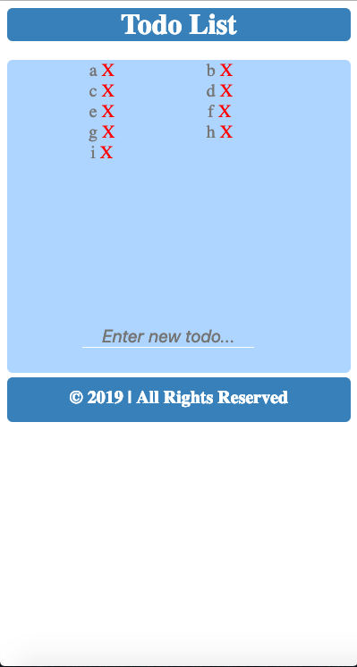
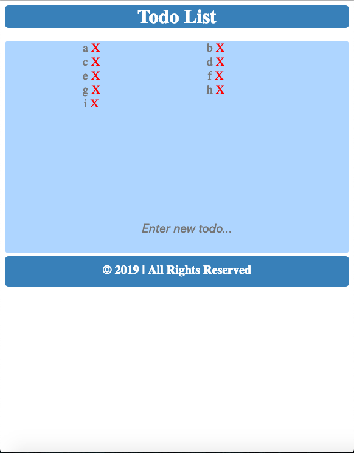
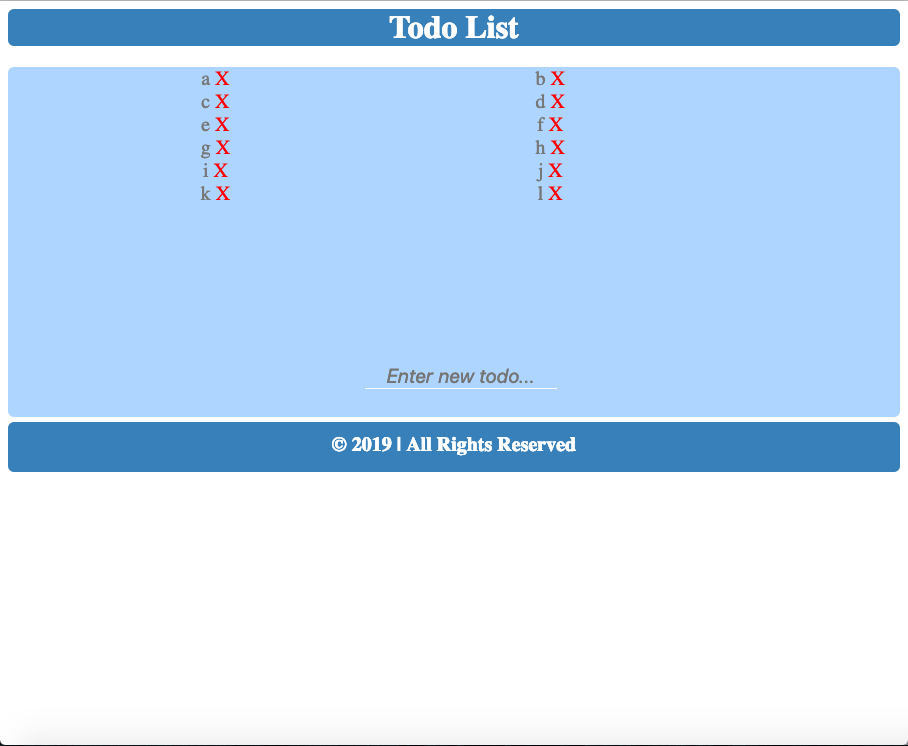
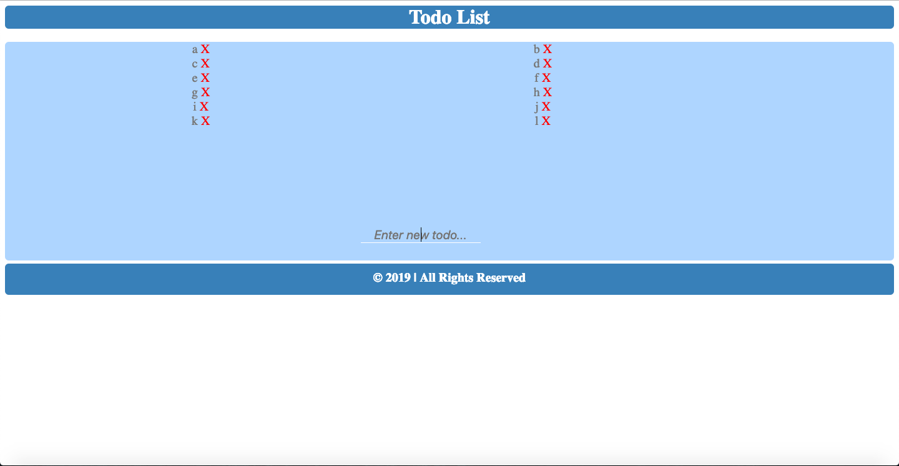
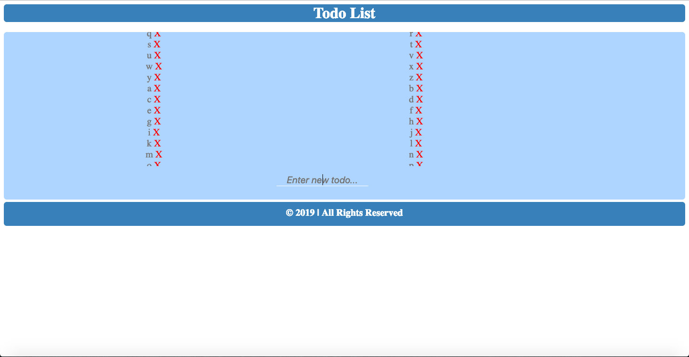

# Todo List

### How to start
> 1. To open the app go to the project's download folder
> 2. Right click on the file name _index.html_
> 3. Click on the _open with_ option
> 4. Chose a browser to use the app in

### How to use
> 1. Enter desired todo into the input field
> 2. Press the enter key to add the todo
> 3. Press the "X" symbol next to a todo to delete it

### Requirements
- This game requires a browser to run
- The browser needs to have Javascipt available and enabled

### Preview

**Thank you for downloading this project :)**